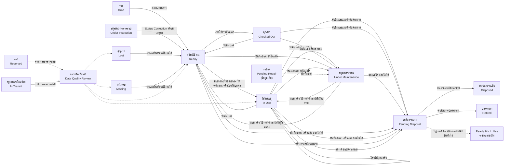
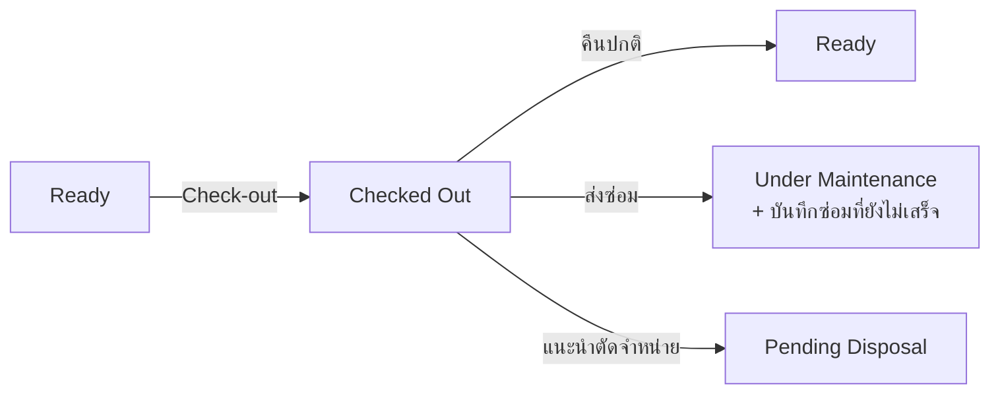
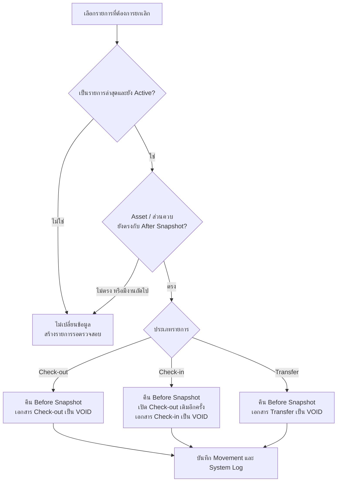
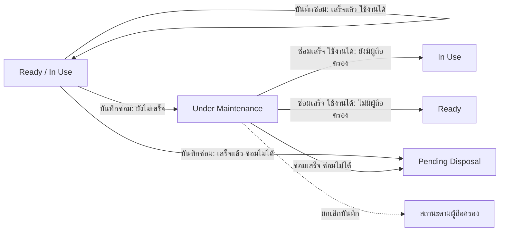
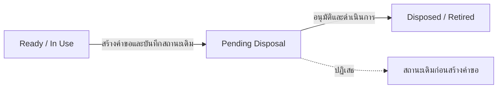
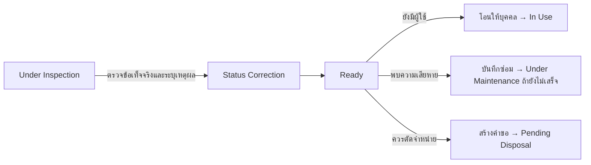
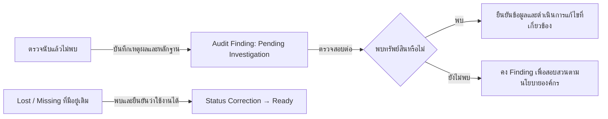

# Workflow สถานะทรัพย์สิน

เอกสารนี้สรุปขั้นตอนเปลี่ยนสถานะทรัพย์สินสำหรับผู้ใช้งาน โดยอ้างอิงกฎที่ระบบบังคับใช้ในปัจจุบัน

> อย่าเปลี่ยนสถานะเพื่อข้ามขั้นตอนจากหน้าแก้ไขทรัพย์สินทั่วไป ให้เริ่มจากเมนูงานที่เกี่ยวข้อง เช่น เบิก รับคืน โอน ซ่อม ตรวจสอบ หรือตัดจำหน่าย เพื่อให้ระบบบันทึกผู้ดำเนินการ เหตุผล เอกสาร และประวัติการเคลื่อนไหวครบถ้วน

## ภาพรวม Workflow



เส้นทึบคือ Workflow ปกติ ส่วนเส้นประคือการแก้ไขแบบควบคุมหรือการดำเนินการผ่านรายการรอตรวจสอบ

## ตารางสถานะและขั้นตอนถัดไป

| สถานะปัจจุบัน | ผู้ใช้งานควรทำอะไร | สถานะผลลัพธ์ |
|---|---|---|
| ร่าง (`Draft`) | กรอกข้อมูลทะเบียนที่จำเป็นให้ครบ | พร้อมใช้งาน (`Ready`) |
| พร้อมใช้งาน (`Ready`) | มอบหมายใช้งานประจำให้พนักงาน หรือโอนให้บุคคล | ใช้งานอยู่ (`In Use`) |
| พร้อมใช้งาน (`Ready`) | เบิกใช้งานชั่วคราว | ถูกเบิก (`Checked Out`) |
| พร้อมใช้งาน / ใช้งานอยู่ | บันทึกซ่อม: ซ่อมเสร็จแล้ว / ใช้งานได้ | ไม่เปลี่ยน |
| พร้อมใช้งาน / ใช้งานอยู่ | บันทึกซ่อม: ยังซ่อมไม่เสร็จ | อยู่ระหว่างซ่อม (`Under Maintenance`) |
| พร้อมใช้งาน / ใช้งานอยู่ | บันทึกซ่อม: ซ่อมไม่ได้ เสนอจำหน่าย (ต้องไม่มีรายการส่งมอบค้าง) | รอตัดจำหน่าย (`Pending Disposal`) |
| พร้อมใช้งาน / ใช้งานอยู่ | สร้างคำขอตัดจำหน่าย | รอตัดจำหน่าย (`Pending Disposal`) |
| ใช้งานอยู่ (`In Use`) | โอนให้บุคคลอื่น | ยังคงเป็นใช้งานอยู่ (`In Use`) |
| ใช้งานอยู่ (`In Use`) | รับคืนรายการใช้งานประจำและผลปกติ | พร้อมใช้งาน (`Ready`) |
| ใช้งานอยู่ (`In Use`) | รับคืนรายการใช้งานประจำและเลือก **ส่งซ่อม** | อยู่ระหว่างซ่อม (`Under Maintenance`) พร้อมบันทึกซ่อมที่ยังไม่เสร็จ |
| ใช้งานอยู่ (`In Use`) | รับคืนรายการใช้งานประจำและแนะนำตัดจำหน่าย | รอตัดจำหน่าย (`Pending Disposal`) |
| ถูกเบิก (`Checked Out`) | รับคืนและผลปกติ | พร้อมใช้งาน (`Ready`) |
| ถูกเบิก (`Checked Out`) | รับคืนและเลือก **ส่งซ่อม** | อยู่ระหว่างซ่อม (`Under Maintenance`) พร้อมบันทึกซ่อมที่ยังไม่เสร็จ |
| ถูกเบิก (`Checked Out`) | รับคืนและแนะนำตัดจำหน่าย | รอตัดจำหน่าย (`Pending Disposal`) |
| รอซ่อม (`Pending Repair`, ข้อมูลเดิม) | บันทึกซ่อม (หน้าซ่อมบำรุงมีกล่อง "ทรัพย์สินค้างสถานะซ่อมแต่ไม่มีบันทึก") | ยังไม่เสร็จ → `Under Maintenance` · เสร็จ/ใช้งานได้ → สถานะตามผู้ถือครอง · ซ่อมไม่ได้ → `Pending Disposal` |
| อยู่ระหว่างซ่อม (`Under Maintenance`) | กด **ซ่อมเสร็จ** ผลใช้งานได้ โดยทรัพย์สินยังมีผู้ถือครองหรือรายการส่งมอบค้าง | ใช้งานอยู่ (`In Use`) |
| อยู่ระหว่างซ่อม (`Under Maintenance`) | กด **ซ่อมเสร็จ** ผลใช้งานได้ โดยไม่มีผู้ถือครอง | พร้อมใช้งาน (`Ready`) |
| อยู่ระหว่างซ่อม (`Under Maintenance`) | กด **ซ่อมเสร็จ** ผลซ่อมไม่ได้ เสนอจำหน่าย | รอตัดจำหน่าย (`Pending Disposal`) |
| อยู่ระหว่างซ่อม (`Under Maintenance`) | **ยกเลิกบันทึก** ที่บันทึกผิด | สถานะตามผู้ถือครอง (`In Use` / `Ready`) |
| รอตัดจำหน่าย (`Pending Disposal`) | ดำเนินการตัดจำหน่าย | ตัดจำหน่ายแล้ว (`Disposed`) |
| รอตัดจำหน่าย (`Pending Disposal`) | ดำเนินการปลดระวาง | ปลดระวาง (`Retired`) |
| รอตัดจำหน่าย (`Pending Disposal`) | ผู้อนุมัติปฏิเสธคำขอ | คืนสถานะเดิมที่บันทึกไว้ก่อนสร้างคำขอ |
| อยู่ระหว่างตรวจสอบ (`Under Inspection`) | สรุปผลและทำ Status Correction พร้อมเหตุผล | พร้อมใช้งาน (`Ready`) ก่อนเริ่ม Workflow ถัดไป |
| สูญหาย / หาไม่พบ (`Lost` / `Missing`) | พบทรัพย์สินและยืนยันว่าใช้งานได้ แล้วทำ Status Correction | พร้อมใช้งาน (`Ready`) |
| จอง / อยู่ระหว่างโอนย้าย (`Reserved` / `In Transit`) | ตรวจข้อเท็จจริงผ่านรายการรอตรวจสอบ | `Ready`, `In Use`, `Missing` หรือ `Lost` ตามตัวเลือกที่ระบบอนุญาต |
| ตัดจำหน่ายแล้ว / ปลดระวาง (`Disposed` / `Retired`) | ไม่มีขั้นตอนใช้งานปกติ | เป็นสถานะปิด; แก้กลับ `Ready` ได้เฉพาะกรณีบันทึกผิด |

## Workflow การลงทะเบียนและโอนให้บุคคล


- เมื่อโอนให้บุคคล ระบบตั้งสถานะ `In Use` อัตโนมัติ ผู้ทำรายการไม่ต้องเลือกสถานะอีกครั้ง
- การย้ายเฉพาะสถานที่หรือแผนกโดยไม่เลือกผู้ถือครองจะคงสถานะเดิม
- การโอนให้บุคคลรองรับเฉพาะทรัพย์สินที่เป็น `Ready` หรือ `In Use` และต้องไม่มีรายการเบิกที่ยังเปิดอยู่

## Workflow การเบิกและรับคืน



- การเบิกรองรับเฉพาะสถานะ `Ready`
- การรับคืนปกติต้องอ้างอิงรายการเบิกที่ยังเปิดอยู่
- สำหรับข้อมูลเก่าที่มีผู้ถือครองแต่ไม่มีรายการเบิก ระบบจะสร้างรายการส่งมอบย้อนหลังที่ตรวจสอบได้ก่อน แล้วจึงใช้การรับคืนปกติ
- ผู้รับคืนต้องเลือกสภาพหลังคืนและสถานะผลลัพธ์ตามข้อเท็จจริง สภาพที่เลือกไม่เปลี่ยน Workflow ให้อัตโนมัติ

## Workflow การยกเลิกรายการส่งมอบ รับคืน และโอนย้าย



- ผู้ยกเลิกต้องมีสิทธิ์ `asset:edit` และระบุเหตุผลอย่างน้อย 5 ตัวอักษร
- Cancellation เป็นรายการชดเชยที่คืนค่าจาก Snapshot ไม่ใช่การเลือกสถานะย้อนกลับด้วยตนเอง และไม่ใช่ Status Correction
- ระบบคืนสถานะ สภาพ สถานที่ ผู้ถือครอง แผนก สาขา และส่วนควบเท่าที่รายการเดิมบันทึกไว้แบบ transaction เดียว
- เมื่อยกเลิก Check-in รายการส่งมอบเดิมจะกลับมาเปิดเพื่อให้ทำ Check-in ที่ถูกต้องใหม่ได้ โดยเอกสาร VOID เดิมยังคงอยู่เป็นหลักฐาน
- รายการเก่าที่ไม่มี Snapshot หรือรายการที่ข้อมูลเปลี่ยนต่อแล้วจะไม่ถูกคืนค่าบางส่วน แต่จะเข้ารายการรอตรวจสอบเพื่อให้ผู้ดูแลตรวจข้อเท็จจริง

## Workflow งานซ่อม



- งานซ่อมเป็น "บันทึกการซ่อม" ฟอร์มเดียว สถานะของบันทึกมี 3 แบบ: ยังซ่อมไม่เสร็จ (`in_progress`) · ซ่อมเสร็จแล้ว (`closed` พร้อมผลการซ่อม `usable` / `beyond_repair`) · ยกเลิก (`cancelled`)
- ทรัพย์สินหนึ่งชิ้นมีบันทึกที่ยังไม่เสร็จได้ครั้งละ 1 ใบ · ทรัพย์สินที่ตัดจำหน่ายหรือปลดระวางแล้วบันทึกซ่อมไม่ได้
- ของที่ถูกเบิกชั่วคราว (`Checked Out`) ต้องรับคืนก่อนจึงบันทึกแบบยังไม่เสร็จได้ · ของที่ยังมีรายการส่งมอบค้างต้องรับคืนก่อนจึงเลือก "ซ่อมไม่ได้" ได้
- "สถานะตามผู้ถือครอง" คือ `In Use` เมื่อยังมีรายการส่งมอบที่ยังไม่คืนหรือมีผู้ถือครองส่วนบุคคล มิฉะนั้น `Ready`
- บันทึกจากแผน PM ("บันทึกว่าทำแล้ว") ใช้กฎเดียวกัน และเลื่อนกำหนด PM ครั้งถัดไปให้ ไม่มีการสร้างใบงาน PM อัตโนมัติแล้ว
- ไม่มีขั้นตอนรับเรื่อง รออะไหล่ รอปิดงาน เช็กลิสต์ปิดงาน หรือการอนุมัติปิดงานซ่อมแล้ว ขั้นตอนทีละข้อดูที่ [บันทึกซ่อมทำยังไง](./17_REPAIR_RECORD_GUIDE_TH.md)

## Workflow การตัดจำหน่าย



- สถานะต้นทางที่รองรับตามนโยบายธุรกิจคือ `Ready` และ `In Use`
- เมื่อสร้างคำขอ ระบบบันทึกสถานะเดิมไว้ก่อนเปลี่ยนเป็น `Pending Disposal`
- หากคำขอถูกปฏิเสธ ระบบคืนสถานะเดิมที่บันทึกไว้ ไม่ได้บังคับกลับ `Ready` เสมอ
- รายการเก่าที่ไม่มีสถานะเดิมที่เชื่อถือได้ต้องเข้ารายการรอตรวจสอบ ห้ามเดาสถานะ
- `Disposed` และ `Retired` เป็นสถานะปิด ไม่สามารถเบิกหรือโอนตามปกติ

## Workflow อยู่ระหว่างตรวจสอบ



`Under Inspection` ยังเป็นสถานะใช้งานจริง แต่ระบบปัจจุบันรองรับทางออกที่ชัดเจนผ่าน Status Correction กลับ `Ready` ก่อน จากนั้นจึงเริ่ม Workflow โอน ซ่อม หรือตัดจำหน่าย ห้ามแก้สถานะผ่านหน้าแก้ไขทรัพย์สินทั่วไป

## Workflow หาไม่พบและสูญหาย



- การกด **ไม่พบ** ในงานตรวจนับสร้าง Finding สำหรับสอบสวน แต่ไม่เปลี่ยนสถานะทรัพย์สินเป็น `Missing` หรือ `Lost` อัตโนมัติ
- ระบบยังไม่มี Workflow ปกติสำหรับยืนยันจาก `Missing` ไป `Lost` หรือสร้างสถานะเหล่านี้จากผลตรวจนับ
- ทรัพย์สินที่มีสถานะ `Missing` หรือ `Lost` อยู่แล้วสามารถกลับ `Ready` ผ่าน Status Correction เมื่อพบและยืนยันว่าใช้งานได้ พร้อมระบุเหตุผลและเก็บประวัติ

## การย้อนสถานะและ Status Correction

ใช้ Status Correction เฉพาะกรณีบันทึกสถานะผิดหรือจบการตรวจสอบแล้ว ไม่ใช้เพื่อข้าม Workflow ปกติ

| สถานะต้นทาง | สถานะที่แก้กลับได้ | เงื่อนไข |
|---|---|---|
| `Under Inspection` | `Ready` | สรุปผลตรวจแล้วและระบุเหตุผล |
| `Pending Repair` / `Under Maintenance` | `Ready` | ใช้เฉพาะกรณีสถานะผิด หรือบันทึกซ่อมเลือกผลผิดจนสถานะผิด (เขียนเหตุผลในหมายเหตุของบันทึกซ่อมด้วย) ถ้าทรัพย์สินค้างสถานะซ่อมแต่ไม่มีบันทึก ให้บันทึกซ่อมแทน |
| `Lost` / `Missing` | `Ready` | พบทรัพย์สินและยืนยันว่าใช้งานได้ |
| `Pending Disposal` | `Ready` | ใช้เฉพาะการแก้สถานะผิด; การปฏิเสธคำขอปกติต้องคืนสถานะเดิมที่บันทึกไว้ |
| `Disposed` / `Retired` | `Ready` | กรณีบันทึกผิดเท่านั้น ต้องตรวจสอบสิทธิ์และหลักฐานอย่างเข้มงวด |

ทุกการแก้ไขต้องมีเหตุผล ระบบจะบันทึก Asset Movement และ System Log เพื่อการตรวจสอบย้อนหลัง

## ข้อจำกัดที่ต้องทราบ

1. `Under Inspection` ยังไม่มีหน้าสรุปผลที่ส่งตรงไป `Under Maintenance`, `Pending Disposal`, `Missing` หรือ `Lost` ต้องกลับ `Ready` แบบควบคุมก่อนเข้าสู่ Workflow ที่รองรับ
2. Audit Mark Not Found ไม่เปลี่ยน Lifecycle ของทรัพย์สินอัตโนมัติ
3. `Reserved` และ `In Transit` เป็นสถานะเก่าแบบควบคุม ไม่มี Workflow การจองหรือรับปลายทางปกติ
4. นโยบายกำหนดให้คำขอตัดจำหน่ายเริ่มจาก `Ready` หรือ `In Use`; Route Guard ยังต้องได้รับการปรับให้บังคับต้นทางนี้ครบถ้วน จึงไม่ควรตีความการที่หน้าจอหรือ API รับสถานะอื่นได้ว่าเป็น Workflow ที่รองรับ

## Workflow การถือครอง

```text
พร้อมใช้งาน
  ├─ มอบหมายใช้งานประจำให้พนักงาน ─> ใช้งานอยู่ ─> รับคืน
  └─ เบิกใช้งานชั่วคราว ───────────> ถูกเบิก ───> รับคืน

รับคืน ─> พร้อมใช้งาน / ส่งซ่อม (อยู่ระหว่างซ่อม) / รอตัดจำหน่าย
ยกเลิกรับคืน ─> คืนสถานะตาม Snapshot: ใช้งานอยู่ (ประจำ) / ถูกเบิก (ชั่วคราว)
```

รายการที่มีประเภทหาย/ขัดแย้ง หรือสถานะไม่ตรงกับประเภท จะเข้าสู่รายการรอตรวจสอบและไม่ถูกเดาสถานะอัตโนมัติ

## เอกสารอ้างอิง

- [คู่มือสถานะทรัพย์สินสำหรับผู้ใช้งาน](./15_ASSET_STATUS_USER_GUIDE_TH.md)
- [บันทึกซ่อมทำยังไง](./17_REPAIR_RECORD_GUIDE_TH.md)
- [Asset Lifecycle สำหรับนักพัฒนา](./05_ASSET_LIFECYCLE.md)
- [Workflow ของระบบ](./06_WORKFLOWS.md)
- [UAT Checklist](./07_UAT_CHECKLIST.md)
