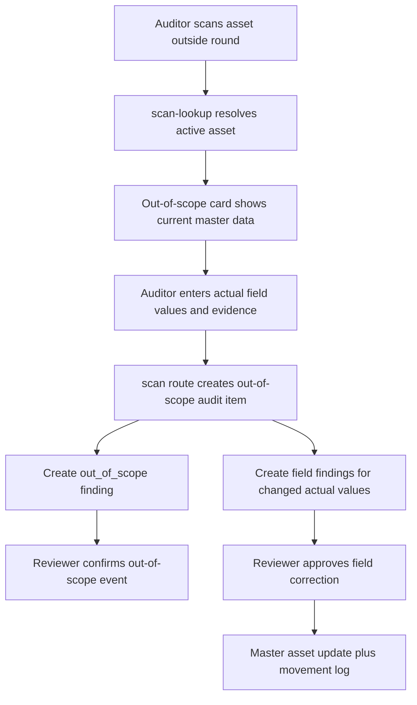

# Audit Out-of-Scope Actual Field Design

## Goal

Allow field auditors to record the actual location, custodian, department, and condition when an asset is found outside the audit round scope, while keeping master asset updates behind the existing permission and review workflow.

The field workflow should capture what was physically found. The system of record should change only after an authorized review decision.

## Decision

Use a two-step governance model:

1. Audit Scan records the out-of-scope event and the actual field values found on site.
2. Audit Finding review applies master asset updates only after an authorized reviewer approves the relevant field findings.

This keeps walking audits fast without letting every out-of-scope scan silently change custody, location, department, or condition.

## Current Behavior

- `/th/audit/rounds/{id}/scan` can resolve an out-of-round printed QR through `POST /api/audit-rounds/{id}/scan-lookup`.
- `POST /api/audit-rounds/{id}/scan` already creates an `audit_item`, `audit_finding`, and `audit_scan_history` for out-of-scope assets.
- Existing review logic in `POST /api/audit-findings/{id}/review` can update master asset fields for these finding types:
  - `wrong_location`
  - `wrong_custodian`
  - `wrong_department`
  - `wrong_condition`
- The current out-of-scope path creates only an `out_of_scope` finding, so there is no field-specific finding for the reviewer to approve and apply to the master asset.

## Non-Negotiables

- Do not update master asset fields directly from the out-of-scope scan save.
- Preserve RBAC: scan capture stays under `audit:edit`; review and master update stays under `audit:approve`.
- Preserve segregation-of-duties checks for finding review.
- Preserve audit trail expectations through `audit_findings`, `audit_scan_history`, `asset_movements`, and `system_logs`.
- Do not add a database migration for this phase.
- Do not change the meaning of `out_of_scope`: it remains the signal that the asset exists but was not part of the audit round scope.

## Recommended Approach

Extend the out-of-scope scan flow to collect and store actual field values, then create field-specific findings when those values differ from the asset's current master data.

When the auditor saves an out-of-scope asset:

- Always create the out-of-scope audit item and `out_of_scope` finding.
- Store actual values on the out-of-scope audit item:
  - `actualLocationId`
  - `actualCustodianId`
  - `actualDepartmentId`
  - `actualConditionId`
- Create additional findings only for changed fields:
  - actual location differs from `Asset.currentLocationId` -> `wrong_location`
  - actual custodian differs from `Asset.custodianId` -> `wrong_custodian`
  - actual department differs from `Asset.departmentId` -> `wrong_department`
  - actual condition differs from `Asset.conditionId` -> `wrong_condition`

The existing review route will continue to own master updates for those field-specific findings.

Rejected alternatives:

- Direct master update from out-of-scope scan: fastest for field users, but too risky for custody/accounting and weakens review controls.
- Only record text remarks on out-of-scope findings: simple, but reviewers cannot approve structured field corrections or produce reliable reports.
- Add a new correction workflow separate from findings: more explicit, but duplicates the existing approval and movement-log machinery.

## UI Behavior

On the out-of-scope card in `AuditScanForm`:

- Show the resolved asset identity and current master values.
- Add a compact `ข้อมูลที่พบจริง` section before the save action.
- Prefill actual fields from the asset's current master values so a user only changes the fields that are different.
- Reuse existing option lists for locations, employees, departments, and conditions.
- Keep the primary action as `บันทึกเป็นรายการนอก Scope`.
- Add helper copy clarifying that saving records the finding and actual values, but master data changes only after review.

Evidence handling:

- Evidence photos remain optional if the user is only recording an out-of-scope event with no field changes.
- If any actual field differs from master data, require at least one audit evidence photo before saving, matching the current mismatch discipline.

## API Behavior

`POST /api/audit-rounds/{id}/scan-lookup` should return enough current master data for the out-of-scope card to prefill actual fields:

- `currentLocationId`
- `custodianId`
- `departmentId`
- `conditionId`
- `ownershipType`

`POST /api/audit-rounds/{id}/scan` should keep accepting the existing scan payload fields and use them for out-of-scope assets:

- If an actual field is missing, fall back to the asset's current master value.
- Save the chosen actual values on the created `audit_item`.
- Create the existing `out_of_scope` finding.
- Create field-specific findings for changed actual values.
- Keep scan history raw payload bounded and useful by including the submitted actual values and `outOfScope: true`.

`POST /api/audit-findings/{id}/review` should treat `out_of_scope` approval as a confirmation finding with no master update:

- Approve: set `reviewStatus = approved`, `actionTaken = out_of_scope_confirmed_no_master_update`.
- Reject: use the existing rejection path.
- Field-specific findings continue to update master asset data through the existing review path.

## Data Flow

## Error Handling

- If the asset no longer exists or is inactive before saving, return the existing asset-not-found behavior.
- If the audit round is closed, keep rejecting the scan save.
- If an actual field id is invalid, rely on Prisma relation constraints and return a normal API error.
- If required evidence is missing for changed out-of-scope actual fields, block the client before submit and keep the API tolerant enough for queued/offline scan payloads.

## Testing

Add regression coverage for:

- The out-of-scope card exposes actual field controls and posts actual values.
- Out-of-scope scan save stores actual values on the created audit item.
- Out-of-scope scan save creates `out_of_scope` plus changed field findings.
- Master asset fields are not updated by the out-of-scope scan save.
- Approving `out_of_scope` does not update master asset data.
- Approving field-specific findings still updates master data and creates movement logs through the existing review route.
- The existing scan lookup test still proves `/api/search` is not used for out-of-scope QR lookup.

## Documentation Updates

After implementation, update:

- `DEVELOPER_HANDOFF.md`
- `docs/06_WORKFLOWS.md`
- `docs/07_UAT_CHECKLIST.md`
- `docs/11_FEATURE_LIST.md`
- `docs/99_CHANGELOG.md`

## Scope Boundary

This design does not add a new approval module, a new database table, or a new asset correction page. It extends the existing audit scan and audit finding review flow so field reality is captured immediately and master data remains review-controlled.
